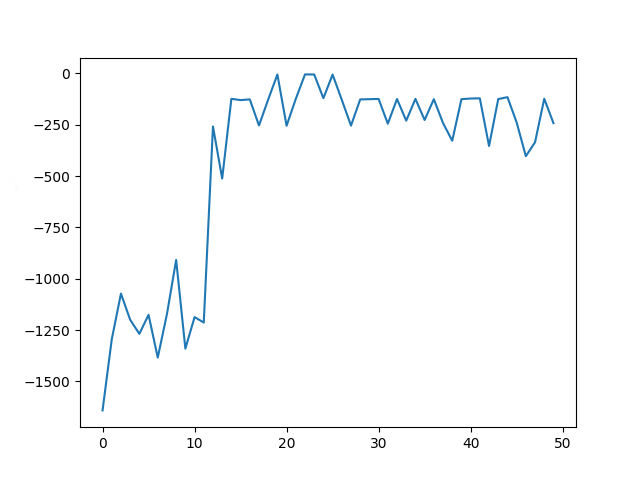

--------------------------
This is the "Closed-loop simulator of complex behavior and learning based on reinforcement learning and deep neural networks" **(CoBeL-RL)**.

Version by date:

2020/03/19: **very preliminary**, initial version, this version might not be stable, and might have other issues. 
Also, the structure of the project might undergo changes. All in all, this version is meant as an initial demonstration 
of the project. If you try it, please **keep this in mind**. If you find issues, and/or have ideas for enhancing the 
system structure, etc., please enter them in the issue tracker.

**Getting started**:

If you want to quickly try the simulator:

* Install Blender. If Blender is not already present in your system, download and unpack Blender 2.79b from 
https://download.blender.org/release/Blender2.79/
    * Go to the place where your download is, e.g. 
    > cd ~/Downloads
    * Extract the files into a folder of your choice, e.g. if you downloaded blender-2.79b-linux-glibc219-x86_64.tar.bz2 
     and you want to install in /etc/opt:
    > bzip2 -vfd blender-2.79b-linux-glibc219-x86_64.tar.bz2
                                                                                                                                                                                                                                                                                                                                                                                             
    > sudo tar xvf blender-2.79b-linux-glibc219-x86_64.tar -C /etc/opt
                                                                                                                                                                                                                                                                                                                                          
                                                                                                                                                                                                                                                                                                                                          

* Clone the project. (This installs to your home folder, so ~/CoBel-RL)
    > git clone https://gitlab.ruhr-uni-bochum.de/cns/1-frameworks/CoBeL-RL.git

* Setup Python. Create a virtual environment by typing the following commands in the 
terminal: (you can change the path name to whatever you want)
    > python3 -m venv ~/cobel_venv

    > virtualenv cobel_venv

    * Activate your virtual environment with 
    > source ~/cobel_venv/bin/activate

    * Install the dependencies in requirements.txt e.g. by running the following
 command from the CoBel-RL directory:
    >pip install -r requirements.txt --no-index

    Alternatively if you are working from the institute you can activate the provided virtual environment with 
    > source /groups/cns/venv/cobel_rl/venv/bin/activate

* Setup the environment variables. 
    * Make sure that your 'PYTHONPATH' environment variable includes the project's root directory.

        With the virtual environment activated, navigate to your project folder
        > cd ~/CoBeL-RL

        Add the project's directory to the PYTHONPATH enviroment variable
        >export PYTHONPATH="$PWD"

    * Set a 'BLENDER_EXECUTABLE_PATH' environment variable that points to the path containing the 'Blender' executable, e.g.

        > export BLENDER_EXECUTABLE_PATH='/etc/opt/blender-2.79b-linux-glibc219-x86_64/'

    To make it **permanent** you have to edit the ~/.bash_profile file and add both variables  there
    (The $PWD command only gives the current directory, here you would have set it to ~/CoBeL-RL yourself)

* Go to the demo folder
> cd ~/CoBeL-RL/demo/simpleGridGraphDemo/

* Start the demo project: 
>python3 simpleGridGraphDemo.py

* go to **.../mySimulatorFolder/CoBel-RL/demo/simpleGridGraphDemo/**
* start the demo project: **python3 simpleGridGraphDemo.py**

Preliminary information, needs further checking: It seems there are some issues with 'tensorflow', version 1.5.0 and the employed 'python' version. If you experience such compatibility problems and have a 'python' version >=3.7, it might help to downgrade 'python' to a version >=2.7 and <=3.6. However, this is just a preliminary hint, the issue will have to be further explored.

________________________________________________________________________________________________

**Unity Interface**

If you want to try the unity interface demo, you need to perform the the steps described above first.

You got two options to run a demo.

**Password for all 'Sciebo' downloads: cobel_rl**

*  You can use the precompiled versions of the unity environments.

    * Linux: **https://ruhr-uni-bochum.sciebo.de/s/3iFYDgzGxLJ57tv**
    
    * Windows **LINK COMING SOON**
    
    You have to set a system variable named 'UNITY_ENVIRONMENT_EXECUTABLE' to the path of the downloaded environments
    
    > export UNITY_ENVIRONMENT_EXECUTABLE=PATH_TO_ENV_EXEC
    
    and run the unity_demo.py in the demo/unity_demo folder
    
    > python3 demo/unity_demo/unity_demo.py
        
* The other option is to install the unity editor and connect the interface directly with the editor.

    * you need to download and install the 'Unity Hub': **https://docs.unity3d.com/Manual/GettingStartedInstallingHub.html**
    
    * the adapted version of mlagents: **https://ruhr-uni-bochum.sciebo.de/s/8GUszMEC7LgzS7V**
    
    * and the unitypackage for the environments: **https://ruhr-uni-bochum.sciebo.de/s/gdphysRY1P7pAyT**
    
    Then you set up a new project with unity. See: **https://docs.unity3d.com/560/Documentation/Manual/GettingStarted.html**
    
    To import the 'mlagents' framework into your project you select the 'Window/PackageManager' menu item in the editor, 
    then choose 'Add Package From Disk' in the top left corner and open the 'package.json' in the 'ml-agents/com.unity.ml-agents' folder.
    
    To import the environments you select the menu item 'Assets/Import Package/Custom Package' in the editor and open the 
    'unity_resources.unitypackage' you downloaded.
    
    You start training an environment by opening a scene in the 'Assets/Scenes' folder with the 'Project Explorer' of the editor, 
    running the unity_demo.py first and pressing the 'Play' button at the top of the editor screen.
    
    **Note: the demo tries to do option 1) automatically when 'UNITY_ENVIRONMENT_EXECUTABLE' variable is set.**
    
     
     